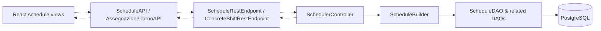
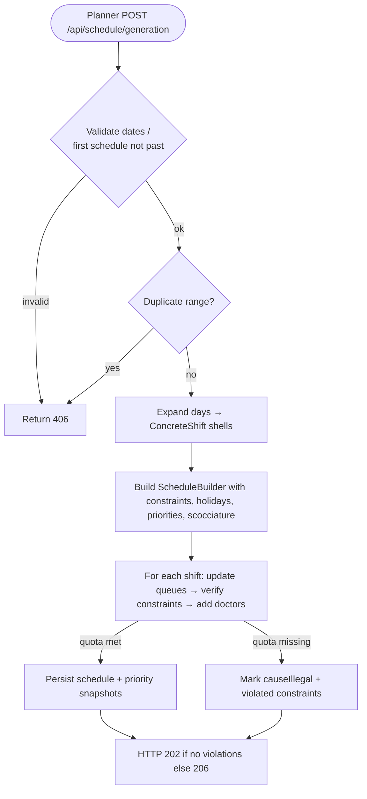
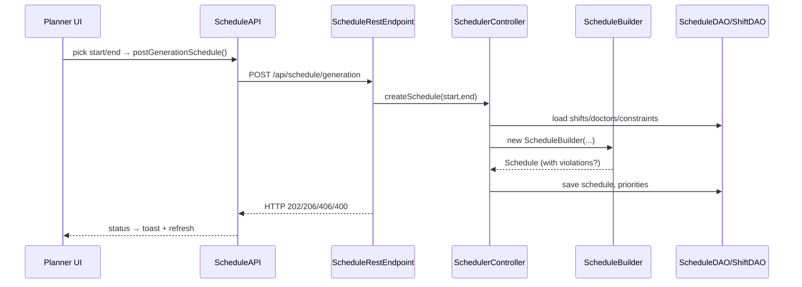

# MS3 Scheduling / Planning — As-Is Analysis

## Purpose and scope
Internal developer-facing snapshot of the current scheduling (pianificazione) feature set as implemented in MS3. Covers end-user behavior (planner/doctor), UI entry points, backend/API/service/data flow, persistence, constraints, security, and notable tests.

## User-facing behavior
### Actors & permissions
- **Planner (PLANNER role)**: only role allowed to generate, regenerate, delete schedules and create/modify/delete concrete shifts; can view all schedules including illegal ones. API enforcement via `@PreAuthorize` on scheduling and concrete shift endpoints.【F:src/main/java/org/cswteams/ms3/rest/ScheduleRestEndpoint.java†L29-L136】【F:src/main/java/org/cswteams/ms3/rest/ConcreteShiftRestEndpoint.java†L42-L160】
- **Doctor (DOCTOR role)**: can view schedules (date list and illegal schedules), view own concrete shifts, and request replacement candidates; cannot generate or delete schedules.【F:src/main/java/org/cswteams/ms3/rest/ScheduleRestEndpoint.java†L88-L118】【F:src/main/java/org/cswteams/ms3/rest/ConcreteShiftRestEndpoint.java†L81-L167】
- **Configurator**: read access to concrete shifts (including incomplete) and illegal schedules.【F:src/main/java/org/cswteams/ms3/rest/ScheduleRestEndpoint.java†L108-L118】【F:src/main/java/org/cswteams/ms3/rest/ConcreteShiftRestEndpoint.java†L99-L114】

### Core planner flows
- **Generate schedule**: From `/generazione-scheduling`, planners open a bottom drawer, pick start/end dates, and trigger POST `/api/schedule/generation`. UI toasts differentiate success (202), incomplete (206), duplicate range (406), or generic errors; the list reloads after creation.【F:frontend/src/views/pianificatore/ScheduleGeneratorView.js†L38-L105】【F:frontend/src/components/common/BottomViewAggiungiSchedulazione.js†L30-L146】【F:frontend/src/API/AssegnazioneTurnoAPI.js†L286-L312】
- **View schedules**: Table shows start/end dates and status (illegal -> “Incompleta”). Latest schedule gets a “Rigenera” button that re-POSTs `/api/schedule/regeneration/id={id}`; deletion uses DELETE `/api/schedule/id={id}` with warnings for past schedules (417).【F:frontend/src/views/pianificatore/ScheduleGeneratorView.js†L107-L200】【F:frontend/src/API/ScheduleAPI.js†L6-L40】
- **Manage concrete shifts**: Planners call POST `/api/concrete-shifts/` to add shifts (optionally forced), PUT to modify, DELETE to remove. Violations return 406/NOT_ACCEPTABLE with constraint messages.【F:src/main/java/org/cswteams/ms3/rest/ConcreteShiftRestEndpoint.java†L42-L160】

### Core doctor flows
- **View personal schedule**: `/pianificazione-privata` loads shifts for the logged-in doctor (`/api/concrete-shifts/user_id={id}`) and renders the scheduler UI specialized for single-user content.【F:frontend/src/views/utente/SingleScheduleView.js†L13-L41】
- **View global schedule**: `/pianificazione-globale` fetches all concrete shifts; planners additionally see a drawer to add manual assignments via `TemporaryDrawer` (not specific to schedule generation).【F:frontend/src/views/utente/GlobalScheduleView.js†L10-L28】
- **Request replacements**: Doctors can query available users for a replacement via POST `/api/concrete-shifts/available-users-for-replacement/` (returns candidates).【F:src/main/java/org/cswteams/ms3/rest/ConcreteShiftRestEndpoint.java†L162-L167】

### UI entry points and navigation
- Routes expose `/generazione-scheduling`, `/pianificazione-privata`, and `/pianificazione-globale` under the default layout.【F:frontend/src/routes.js†L24-L43】
- Navbar links to global planning, and the sidebar adapts by actor (translations in `sidebar-nav-items`). Planner-only create buttons are guarded client-side by role checks (e.g., global schedule view hides assignment drawer for doctors/configurators).【F:frontend/src/views/utente/GlobalScheduleView.js†L21-L27】

### Error handling surfaced to users
- Generation errors map HTTP codes to toasts: 202 success, 206 partial (violations), 406 duplicate interval, generic errors otherwise; regeneration and deletion surface specific errors for past schedules (417) or bad requests.【F:frontend/src/components/common/BottomViewAggiungiSchedulazione.js†L54-L105】【F:frontend/src/views/pianificatore/ScheduleGeneratorView.js†L68-L155】
- Concrete shift APIs return NOT_ACCEPTABLE with constraint descriptions when hard/forced checks fail; BAD_REQUEST on malformed input, NOT_FOUND on missing schedule linkage, EXPECTATION_FAILED on regeneration/delete rules.【F:src/main/java/org/cswteams/ms3/rest/ConcreteShiftRestEndpoint.java†L42-L160】【F:src/main/java/org/cswteams/ms3/rest/ScheduleRestEndpoint.java†L29-L136】

### Multi-tenancy
- A `TenantContext` ThreadLocal exists but scheduling controllers/DAOs do not currently set or check tenant values, so scheduling appears effectively single-tenant in the current code paths.【F:src/main/java/org/cswteams/ms3/tenant/TenantContext.java†L1-L15】

## Technical implementation
### Architecture & data flow
- React views → API clients (`ScheduleAPI`, `AssegnazioneTurnoAPI`) → Spring REST endpoints (`ScheduleRestEndpoint`, `ConcreteShiftRestEndpoint`) → service/controller layer (`SchedulerController`, `ScheduleBuilder`) → JPA DAOs → PostgreSQL.
- Constraint enforcement occurs inside `ScheduleBuilder` when generating schedules and inside `SchedulerController` when adding/modifying concrete shifts; violations populate `Schedule.violatedConstraints` and `causeIllegal` to drive HTTP 206/406 responses.【F:src/main/java/org/cswteams/ms3/control/scheduler/SchedulerController.java†L105-L220】【F:src/main/java/org/cswteams/ms3/control/scheduler/ScheduleBuilder.java†L93-L206】

### Domain model & persistence
- `Schedule`: start/end epoch days, list of `ConcreteShift` entries via join table `schedule_concrete_shifts`, list of violated `Constraint`s via `schedule_violated_constraints`, and transient priority snapshots for doctor queues.【F:src/main/java/org/cswteams/ms3/entity/Schedule.java†L12-L97】
- `ConcreteShift`: date (epoch), associated abstract `Shift`, `DoctorAssignment` list with statuses (ON_DUTY/ON_CALL/REMOVED). Cloning preserves assignments for modification flows.【F:src/main/java/org/cswteams/ms3/entity/ConcreteShift.java†L10-L78】
- DAOs: `ScheduleDAO` queries schedules by containing date and filters illegal schedules; generation ensures no duplicate start/end interval but permits overlaps.【F:src/main/java/org/cswteams/ms3/dao/ScheduleDAO.java†L12-L18】【F:src/main/java/org/cswteams/ms3/control/scheduler/SchedulerController.java†L437-L456】
- Priority queues: `DoctorUffaPriority`/`Snapshot` collections passed through builders to preserve ordering across generations (persisted alongside schedules).【F:src/main/java/org/cswteams/ms3/control/scheduler/SchedulerController.java†L90-L199】

### Backend services & rules
- **Schedule creation**: Validates start <= end and rejects initial historical generation if no schedules exist. Builds concrete shifts for every day in range where an abstract shift’s `daysOfWeek` matches; wraps in `ScheduleBuilder`, attaches constraints/holidays/priorities, and saves schedule plus updated priority records. Returns null on illegal schedule creation (mapped to 406).【F:src/main/java/org/cswteams/ms3/rest/ScheduleRestEndpoint.java†L29-L47】【F:src/main/java/org/cswteams/ms3/control/scheduler/SchedulerController.java†L88-L163】
- **Regeneration**: Restores doctor priority snapshot, deletes existing schedule if not past, then reuses `createSchedule`; failure yields 417/400.【F:src/main/java/org/cswteams/ms3/rest/ScheduleRestEndpoint.java†L52-L69】【F:src/main/java/org/cswteams/ms3/control/scheduler/SchedulerController.java†L165-L199】
- **Concrete shift operations**: Conversions from DTO resolve `Shift` by service/timeslot, build `DoctorAssignment` lists for tasks, check collisions (same doctor on duty & on call), and run constraint validation via `ScheduleBuilder.addConcreteShift` (hard vs. soft `forced`). Illegal outcomes keep DB untouched or revert to old assignment on modification.【F:src/main/java/org/cswteams/ms3/control/scheduler/SchedulerController.java†L202-L362】【F:src/main/java/org/cswteams/ms3/control/scheduler/ScheduleBuilder.java†L206-L286】
- **Constraint evaluation**: `ScheduleBuilder` iterates constraints (`verifyConstraint`) within `ContextConstraint`, logs violations, and for generation stops on hard violations while allowing forced insertion of soft ones. Not enough feasible doctors raises `NotEnoughFeasibleUsersException`, marking schedule illegal and accumulating violated constraints.【F:src/main/java/org/cswteams/ms3/control/scheduler/ScheduleBuilder.java†L93-L206】【F:src/main/java/org/cswteams/ms3/control/scheduler/ScheduleBuilder.java†L286-L351】

### API surface (key scheduling endpoints)
- `POST /api/schedule/generation` (PLANNER): body `ScheduleGenerationDTO` -> 202 accepted, 206 partial (violations), 406 duplicate range, 400 invalid dates.【F:src/main/java/org/cswteams/ms3/rest/ScheduleRestEndpoint.java†L29-L47】
- `POST /api/schedule/regeneration/id={id}` (PLANNER): 202 ok, 417 expectation failed (past/not deleted), 400 on exception.【F:src/main/java/org/cswteams/ms3/rest/ScheduleRestEndpoint.java†L52-L69】
- `GET /api/schedule/` (PLANNER): list of `ScheduleDTO` (start/end/id/isIllegal).【F:src/main/java/org/cswteams/ms3/rest/ScheduleRestEndpoint.java†L71-L80】
- `GET /api/schedule/dates/` (DOCTOR/PLANNER): condensed schedule info for planner UI (dates + violation flag).【F:src/main/java/org/cswteams/ms3/rest/ScheduleRestEndpoint.java†L84-L106】
- `GET /api/schedule/illegals` (DOCTOR/PLANNER/CONFIGURATOR): schedules with violated constraints.【F:src/main/java/org/cswteams/ms3/rest/ScheduleRestEndpoint.java†L108-L118】
- `DELETE /api/schedule/id={id}` (PLANNER): deletes future schedules only; returns 417 otherwise.【F:src/main/java/org/cswteams/ms3/rest/ScheduleRestEndpoint.java†L120-L136】
- `POST /api/concrete-shifts/` (PLANNER): add shift, returning 202 on success, 406 with constraint messages on violations, 404 if schedule missing, 400 on bad input.【F:src/main/java/org/cswteams/ms3/rest/ConcreteShiftRestEndpoint.java†L42-L79】
- `PUT /api/concrete-shifts/` (PLANNER): modify shift; returns 202 when constraints satisfied, 406 with log otherwise.【F:src/main/java/org/cswteams/ms3/rest/ConcreteShiftRestEndpoint.java†L116-L148】
- `DELETE /api/concrete-shifts/{id}` (PLANNER): removes shift assignment and entity.【F:src/main/java/org/cswteams/ms3/rest/ConcreteShiftRestEndpoint.java†L151-L160】
- `GET /api/concrete-shifts/` (CONFIGURATOR/DOCTOR/PLANNER): all shifts; `/incomplete` filters to INCOMPLETE state.【F:src/main/java/org/cswteams/ms3/rest/ConcreteShiftRestEndpoint.java†L99-L114】
- `GET /api/concrete-shifts/user_id={userID}` (DOCTOR): shifts for a specific doctor.【F:src/main/java/org/cswteams/ms3/rest/ConcreteShiftRestEndpoint.java†L81-L97】
- `POST /api/concrete-shifts/available-users-for-replacement/` (DOCTOR): returns candidate doctors for replacement.【F:src/main/java/org/cswteams/ms3/rest/ConcreteShiftRestEndpoint.java†L162-L167】

## Scheduling generation algorithm (as-is)
### Purpose and triggers
- Automates population of concrete shifts for a date range using shift templates, respecting seniority/task counts, constraint rules, holidays, and doctor “uffa” priorities. Creation is invoked by planners via `POST /api/schedule/generation`, while `POST /api/schedule/regeneration/id={id}` deletes and rebuilds an existing window after restoring saved priority snapshots.【F:src/main/java/org/cswteams/ms3/rest/ScheduleRestEndpoint.java†L29-L69】【F:src/main/java/org/cswteams/ms3/control/scheduler/SchedulerController.java†L165-L199】

### Inputs and preparatory checks
- **Date window**: start/end LocalDate from the request; `ScheduleBuilder` rejects inverted ranges, and the controller forbids the very first schedule if it starts in the past.【F:src/main/java/org/cswteams/ms3/control/scheduler/ScheduleBuilder.java†L63-L116】【F:src/main/java/org/cswteams/ms3/control/scheduler/SchedulerController.java†L100-L143】
- **Uniqueness**: generation aborts when an identical start/end range already exists (overlaps allowed).【F:src/main/java/org/cswteams/ms3/control/scheduler/SchedulerController.java†L105-L158】【F:src/main/java/org/cswteams/ms3/control/scheduler/SchedulerController.java†L437-L456】
- **Shift templates**: for each day in range, all `Shift` templates matching the day of week spawn `ConcreteShift` shells without doctors.【F:src/main/java/org/cswteams/ms3/control/scheduler/SchedulerController.java†L109-L143】
- **Static data**: constraints, doctors, holidays, doctor-holiday mappings, `DoctorUffaPriority` queues, priority snapshots, and “scocciatura” annoyance weights are loaded once and fed into `ScheduleBuilder` and `ControllerScocciatura`.【F:src/main/java/org/cswteams/ms3/control/scheduler/SchedulerController.java†L131-L148】【F:src/main/java/org/cswteams/ms3/control/scocciatura/ControllerScocciatura.java†L25-L118】

### Core generation flow
1) `ScheduleBuilder.build()` resets violations, copies current priorities into snapshots, and normalizes queue values when `ControllerScocciatura` is present.【F:src/main/java/org/cswteams/ms3/control/scheduler/ScheduleBuilder.java†L180-L241】
2) For each concrete shift:
   - **On-duty assignment**: for every seniority/task requirement in `QuantityShiftSeniority`, `addDoctors` tries to place the required number of doctors. Failure to reach the quota throws `NotEnoughFeasibleUsersException`, captured as the schedule’s illegal cause while continuing iteration.【F:src/main/java/org/cswteams/ms3/control/scheduler/ScheduleBuilder.java†L205-L235】【F:src/main/java/org/cswteams/ms3/control/scheduler/ScheduleBuilder.java†L253-L350】
   - **On-call assignment**: repeats the same loop for on-call slots; shortages log violations but do not stop generation.【F:src/main/java/org/cswteams/ms3/control/scheduler/ScheduleBuilder.java†L224-L235】【F:src/main/java/org/cswteams/ms3/control/scheduler/ScheduleBuilder.java†L253-L350】
3) After processing all shifts, updated priority queues attach to the schedule, which is persisted alongside refreshed snapshots and `DoctorUffaPriority` rows.【F:src/main/java/org/cswteams/ms3/control/scheduler/ScheduleBuilder.java†L238-L241】【F:src/main/java/org/cswteams/ms3/control/scheduler/SchedulerController.java†L149-L156】

### Selection, ordering, and constraint checks inside `addDoctors`
- **Priority queues**: before picking doctors, `ControllerScocciatura` adjusts temporary priorities per queue (general always; long-shift when an earlier morning shift exists; night when applicable) and orders candidates after a shuffle to break ties, keeping values within configured bounds from `priority.properties`.【F:src/main/java/org/cswteams/ms3/control/scheduler/ScheduleBuilder.java†L265-L289】【F:src/main/java/org/cswteams/ms3/control/scocciatura/ControllerScocciatura.java†L20-L144】
- **Eligibility filter**: only doctors matching the required seniority are considered; doctor-specific holidays are looked up for constraint context.【F:src/main/java/org/cswteams/ms3/control/scheduler/ScheduleBuilder.java†L291-L307】
- **Constraint evaluation**: each candidate is wrapped in `ContextConstraint` (doctor, concrete shift, holidays) and passed to `verifyAllConstraints` with `isForced=false`, meaning any hard constraint—or a soft one when not forced—blocks assignment and leaves the doctor unpicked.【F:src/main/java/org/cswteams/ms3/control/scheduler/ScheduleBuilder.java†L303-L346】【F:src/main/java/org/cswteams/ms3/control/scheduler/ScheduleBuilder.java†L441-L461】
- **Assignment effects**: successful picks create `DoctorAssignment`, update queue priorities (general plus long-shift/night when relevant), and increment the selected counter; if the required count is not met, a `NotEnoughFeasibleUsersException` signals an incomplete schedule.【F:src/main/java/org/cswteams/ms3/control/scheduler/ScheduleBuilder.java†L306-L350】【F:src/main/java/org/cswteams/ms3/control/scocciatura/ControllerScocciatura.java†L52-L110】

### Outputs and failure modes
- **Successful generation**: returns a `Schedule` with populated concrete shifts, updated priorities, and recorded constraint violations (if any). REST maps an empty violation list to HTTP 202; non-empty violations to 206.【F:src/main/java/org/cswteams/ms3/control/scheduler/ScheduleBuilder.java†L180-L241】【F:src/main/java/org/cswteams/ms3/rest/ScheduleRestEndpoint.java†L29-L44】
- **Illegal or rejected runs**: returning `null` (past initial range, duplicate interval, date validation failure, or `IllegalScheduleException`) yields HTTP 406; regeneration of past schedules is blocked with 417. When constraints prevent filling required slots, `Schedule.causeIllegal` is set, the schedule is still saved with violations, and clients treat it as partial content.【F:src/main/java/org/cswteams/ms3/control/scheduler/SchedulerController.java†L100-L199】【F:src/main/java/org/cswteams/ms3/control/scheduler/ScheduleBuilder.java†L205-L241】【F:src/main/java/org/cswteams/ms3/rest/ScheduleRestEndpoint.java†L29-L69】

### Testing and limitations
- Constraint unit tests exercise individual rules but there is no end-to-end test for generation ordering, priority normalization, or multi-day coverage; shortages and random shuffle behavior remain unverified by automated tests.【F:src/test/java/org/cswteams/ms3/VincoloUbiquitàTest.java†L1-L120】【F:src/test/java/org/cswteams/ms3/VincoloTurniContiguiTest.java†L1-L120】【F:src/test/java/org/cswteams/ms3/VincoloMaxPeriodoConsecutivoTest.java†L1-L120】

### Frontend implementation notes
- Planner schedule management UI shows list and allows regeneration/deletion; creation drawer uses Material UI date pickers and shows loading overlay during API calls.【F:frontend/src/views/pianificatore/ScheduleGeneratorView.js†L38-L200】【F:frontend/src/components/common/BottomViewAggiungiSchedulazione.js†L30-L151】
- Global and single schedule views inherit from a shared `ScheduleView` (not modified here) that handles filtering, CSV export, and shift editing; global view conditionally renders assignment drawer based on actor role.【F:frontend/src/views/utente/GlobalScheduleView.js†L10-L28】【F:frontend/src/views/utente/SingleScheduleView.js†L13-L41】
- API clients encapsulate fetch calls with auth headers and map HTTP status to UI behavior; schedule APIs use `/api/schedule/*` while shift allocation uses `/api/concrete-shifts/*`.【F:frontend/src/API/ScheduleAPI.js†L6-L40】【F:frontend/src/API/AssegnazioneTurnoAPI.js†L277-L313】

### Sequence: schedule generation (planner)

### Persistence/validation constraints
- Concrete shifts reference `Shift` templates and doctor assignments; `ScheduleBuilder` verifies constraints (hard vs. soft), holidays, and doctor priority queues before committing assignments. Violated constraints are stored on the schedule for planner review.【F:src/main/java/org/cswteams/ms3/control/scheduler/ScheduleBuilder.java†L93-L206】【F:src/main/java/org/cswteams/ms3/control/scheduler/SchedulerController.java†L202-L362】
- Deleting schedules clears foreign key references from doctor priority records before removal; schedules in the past are protected from deletion/regeneration.【F:src/main/java/org/cswteams/ms3/control/scheduler/SchedulerController.java†L413-L434】
- Schedule overlaps are allowed except for exact duplicate ranges; this is the only duplication check in creation logic.【F:src/main/java/org/cswteams/ms3/control/scheduler/SchedulerController.java†L100-L108】【F:src/main/java/org/cswteams/ms3/control/scheduler/SchedulerController.java†L437-L456】

### Testing footprint
- Constraint-focused unit tests (`VincoloUbiquitàTest`, `VincoloTurniContiguiTest`, `VincoloMaxPeriodoConsecutivoTest`) create `Schedule` and `UserScheduleState` instances to validate rule enforcement, indicating partial coverage of constraint logic but limited end-to-end scheduling tests.【F:src/test/java/org/cswteams/ms3/VincoloUbiquitàTest.java†L1-L120】【F:src/test/java/org/cswteams/ms3/VincoloTurniContiguiTest.java†L1-L120】【F:src/test/java/org/cswteams/ms3/VincoloMaxPeriodoConsecutivoTest.java†L1-L120】

## Open questions / ambiguities
- Tenant isolation: `TenantContext` is unused in scheduling paths; unclear if multi-tenant support is intentionally disabled or configured elsewhere.
- Constraint catalog: REST exposes violations, but the authoritative list/semantics of constraint types are spread across `entity/constraint` classes; some hard vs. soft behavior is inferred but not documented.
- Schedule validity states: UI labels “Incompleta” for illegal schedules but backend distinguishes partial content vs. illegal; mapping of `ShiftState.INCOMPLETE` vs. schedule illegal status is not unified.
- Snapshot/priority lifecycle: regeneration restores snapshots, but concurrency/rollback behavior for partial failures is unspecified.
