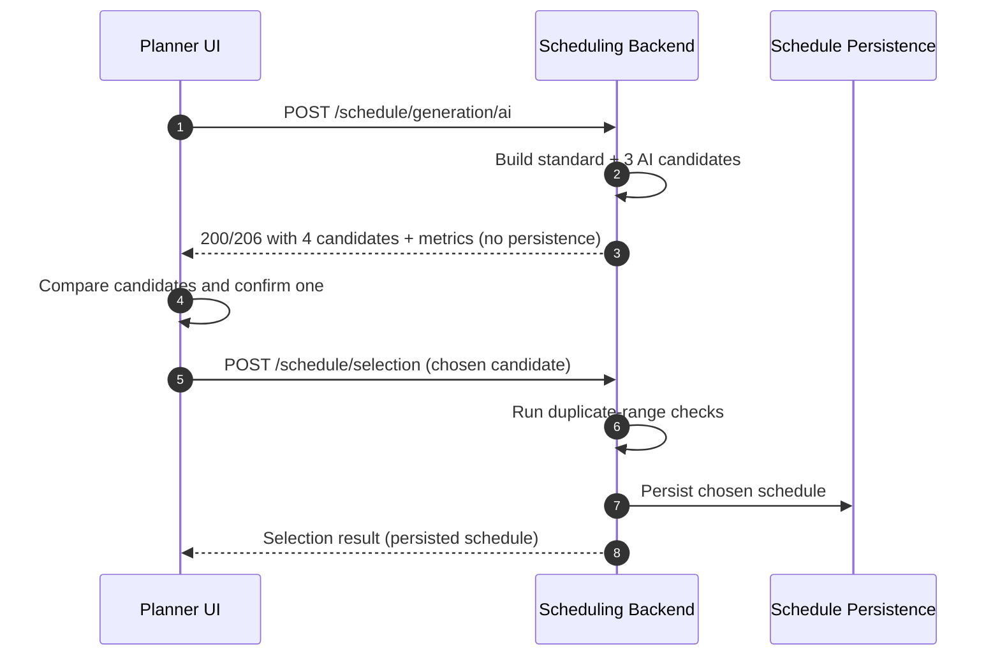

# Scheduling Generation/Selection Flow (Authoritative)

This note clarifies the split between **candidate generation** and **schedule persistence** for both backend and frontend maintainers.

## API contract

1. `POST /schedule/generation/ai` returns **4 candidates**:
   - 1 standard candidate (baseline)
   - 3 AI candidates
   - **No candidate is persisted at generation time**.
2. `POST /schedule/selection` is the **only endpoint** that persists a schedule.
3. Duplicate-range checks are enforced **during selection persistence** (`POST /schedule/selection`), not during generation preview.

## Planner UI flow

1. Trigger generation and fetch candidate comparison (`POST /schedule/generation/ai`).
2. Inspect comparison metrics for all four candidates.
3. Confirm exactly one candidate.
4. Persist only the confirmed candidate (`POST /schedule/selection`).

## Sequence diagram

