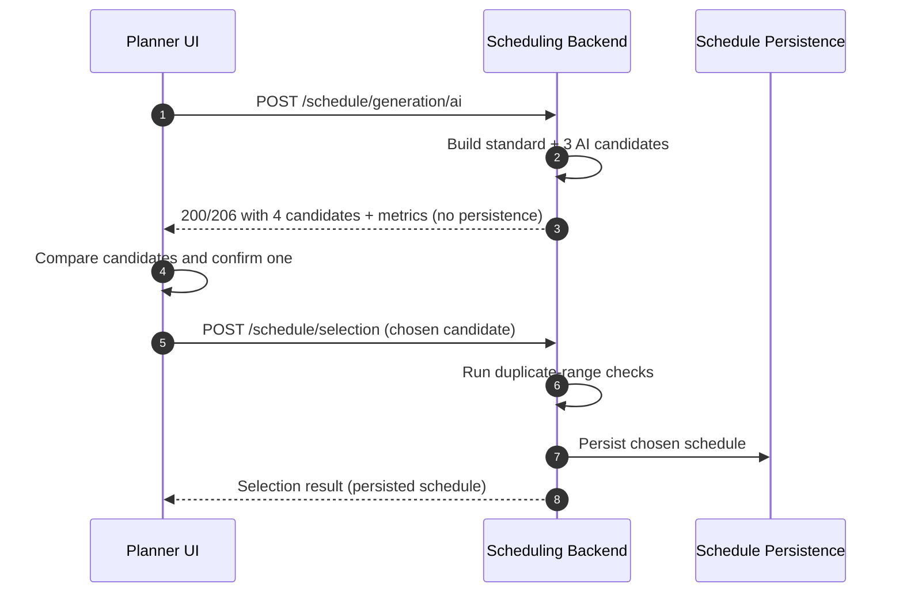

# Scheduling Generation/Selection Flow (Authoritative)

This note clarifies the split between **candidate generation** and **schedule persistence** for both backend and frontend maintainers.

## API contract

1. `POST /schedule/generation/ai` returns **4 candidates**:
   - 1 standard candidate (baseline)
   - 3 AI candidates
   - **No candidate is persisted at generation time**.
2. `POST /schedule/selection` is the **only endpoint** that persists a schedule.
3. Duplicate-range checks are enforced **during selection persistence** (`POST /schedule/selection`), not during generation preview.

## Planner UI flow

1. Trigger generation and fetch candidate comparison (`POST /schedule/generation/ai`).
2. Inspect comparison metrics for all four candidates.
3. Confirm exactly one candidate.
4. Persist only the confirmed candidate (`POST /schedule/selection`).

## Feature timeline (merge-derived)

### Baseline generation/selection flow
- `6c2c720` → `0a6f84d`: Orchestration was wired to feedback data and the persistence rule was locked to **selected candidate only**, establishing the baseline preview-then-select behavior.

- **Backend REST entry points**
  - `POST /api/schedule/generation/ai` — `ScheduleRestEndpoint#createScheduleWithAi(...)`
  - `POST /api/schedule/selection` — `ScheduleRestEndpoint#selectScheduleCandidate(...)`
- **Core service entry methods**
  - `AiScheduleGenerationOrchestrationService#generateScheduleComparison(...)`
  - `AiScheduleGenerationOrchestrationService#selectSchedule(...)`
- **Frontend entry view/component**
  - `frontend/src/views/pianificatore/ScheduleGeneratorView.js` (`ScheduleGeneratorView`)
- **Supporting docs (`docs/`)**
  - `docs/scheduling/AI-Powered_scheduling_analysis.md`
  - `docs/AI_powered_rescheduling/sprint_4/story_1.md`
- **90-second read path**
  - `src/main/java/org/cswteams/ms3/rest/ScheduleRestEndpoint.java`
  - `src/main/java/org/cswteams/ms3/ai/orchestration/AiScheduleGenerationOrchestrationService.java`
  - `frontend/src/views/pianificatore/ScheduleGeneratorView.js`
  - `frontend/src/API/AssegnazioneTurnoAPI.js`
  - `docs/scheduling/AI-Powered_scheduling_analysis.md`

### Broker integration
- `757a66c` → `f16903f`: The provider-agnostic broker package, retry/timeout controls, and total-timeout guard were introduced, stabilizing external AI call handling.

- **Backend REST entry points**
  - `POST /api/schedule/generation/ai` — `ScheduleRestEndpoint#createScheduleWithAi(...)`
- **Core service entry methods**
  - `AiScheduleGenerationOrchestrationService#generateScheduleComparison(...)`
  - `AgentBrokerImpl#requestSchedule(...)`
- **Frontend entry view/component**
  - `frontend/src/views/pianificatore/ScheduleGeneratorView.js` (`ScheduleGeneratorView`)
- **Supporting docs (`docs/`)**
  - `docs/AI_powered_rescheduling/sprint_4/ai_agent_comparison.md`
  - `docs/AI_powered_rescheduling/sprint_4/technical_doc_draft.md`
- **90-second read path**
  - `src/main/java/org/cswteams/ms3/rest/ScheduleRestEndpoint.java`
  - `src/main/java/org/cswteams/ms3/ai/orchestration/AiScheduleGenerationOrchestrationService.java`
  - `src/main/java/org/cswteams/ms3/ai/broker/AgentBrokerImpl.java`
  - `src/main/java/org/cswteams/ms3/ai/broker/AiBrokerConfiguration.java`
  - `docs/AI_powered_rescheduling/sprint_4/technical_doc_draft.md`

### Validation hardening
- `a1a381f` → `b7f9f53`: Candidate/assignment validation, schema rules, scoring gates, and constraint-focused tests were layered in to tighten acceptance checks before comparison/persistence.

- **Backend REST entry points**
  - `POST /api/schedule/generation/ai` — `ScheduleRestEndpoint#createScheduleWithAi(...)`
  - `POST /api/schedule/selection` — `ScheduleRestEndpoint#selectScheduleCandidate(...)`
- **Core service entry methods**
  - `AiScheduleGenerationOrchestrationService#generateScheduleComparison(...)`
  - `AiScheduleGenerationOrchestrationService#selectSchedule(...)`
- **Frontend entry view/component**
  - `frontend/src/components/common/GenerationStatusFeedback.js` (`GenerationStatusFeedback`)
- **Supporting docs (`docs/`)**
  - `docs/scheduling/AI_agents_in-depth_analysis.md`
  - `docs/AI_powered_rescheduling/dual_layer_coverage_monitoring.md`
- **90-second read path**
  - `src/main/java/org/cswteams/ms3/ai/orchestration/AiScheduleGenerationOrchestrationService.java`
  - `src/main/java/org/cswteams/ms3/rest/ScheduleRestEndpoint.java`
  - `frontend/src/components/common/GenerationStatusFeedback.js`
  - `frontend/src/views/pianificatore/ScheduleGeneratorView.js`
  - `docs/AI_powered_rescheduling/dual_layer_coverage_monitoring.md`

### UI comparison and selection
- `1bf596b` → `cc12d05`: Comparison modal integration, confirmation UX, backend selection endpoints, and UX refinements completed the planner-facing choose-and-confirm loop.

- **Backend REST entry points**
  - `GET /api/comparison` — `ComparisonRestEndpoint#getComparison()`
  - `POST /api/comparison/selection` — `ComparisonRestEndpoint#selectSchedule(...)`
  - `POST /api/schedule/selection` — `ScheduleRestEndpoint#selectScheduleCandidate(...)`
- **Core service entry methods**
  - `AiScheduleGenerationOrchestrationService#getLatestComparison()`
  - `AiScheduleGenerationOrchestrationService#selectSchedule(...)`
- **Frontend entry view/component**
  - `frontend/src/components/common/AiScheduleComparisonModal.js` (`AiScheduleComparisonModal`)
  - `frontend/src/components/common/AiScheduleSelectionConfirmationModal.js` (`AiScheduleSelectionConfirmationModal`)
- **Supporting docs (`docs/`)**
  - `docs/AI_powered_rescheduling/sprint_4/story_4.md`
  - `docs/AI_powered_rescheduling/sprint_4/story_5.md`
- **90-second read path**
  - `src/main/java/org/cswteams/ms3/rest/ComparisonRestEndpoint.java`
  - `src/main/java/org/cswteams/ms3/rest/ScheduleRestEndpoint.java`
  - `frontend/src/components/common/AiScheduleComparisonModal.js`
  - `frontend/src/components/common/AiScheduleSelectionConfirmationModal.js`
  - `frontend/src/views/pianificatore/ScheduleGeneratorView.js`

### Rollback/rework points
- `d71d1ad` / `e4ca33c` / `568b429` → `bf51cf1`: Validation refactors were rolled back, then reintroduced with split hard/soft outcomes to recover behavior safely after rework.

- **Backend REST entry points**
  - `POST /api/schedule/generation/ai` — `ScheduleRestEndpoint#createScheduleWithAi(...)`
  - `POST /api/schedule/selection` — `ScheduleRestEndpoint#selectScheduleCandidate(...)`
- **Core service entry methods**
  - `AiScheduleGenerationOrchestrationService#generateScheduleComparison(...)`
  - `AiScheduleGenerationOrchestrationService#selectSchedule(...)`
- **Frontend entry view/component**
  - `frontend/src/views/pianificatore/ScheduleGeneratorView.js` (`ScheduleGeneratorView`)
- **Supporting docs (`docs/`)**
  - `docs/AI_powered_rescheduling/sprint_4/retrospective_inputs.md`
  - `docs/AI_powered_rescheduling/sprint_4/sprint_summary.md`
- **90-second read path**
  - `src/main/java/org/cswteams/ms3/ai/orchestration/AiScheduleGenerationOrchestrationService.java`
  - `src/main/java/org/cswteams/ms3/rest/ScheduleRestEndpoint.java`
  - `frontend/src/views/pianificatore/ScheduleGeneratorView.js`
  - `docs/AI_powered_rescheduling/sprint_4/retrospective_inputs.md`

## Sequence diagram

